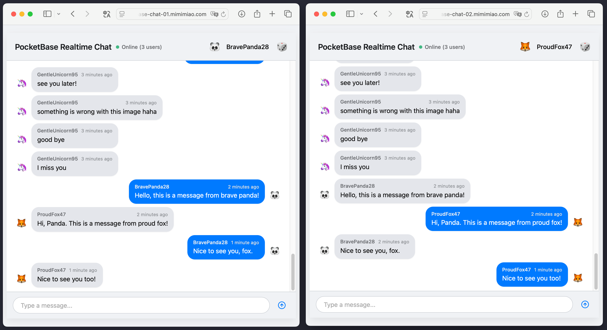
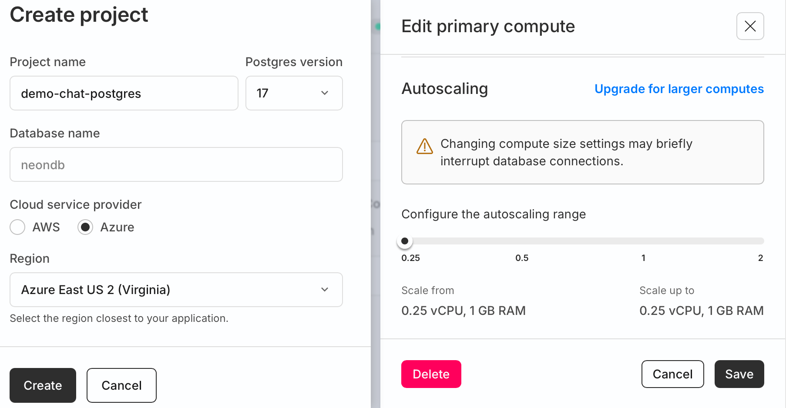
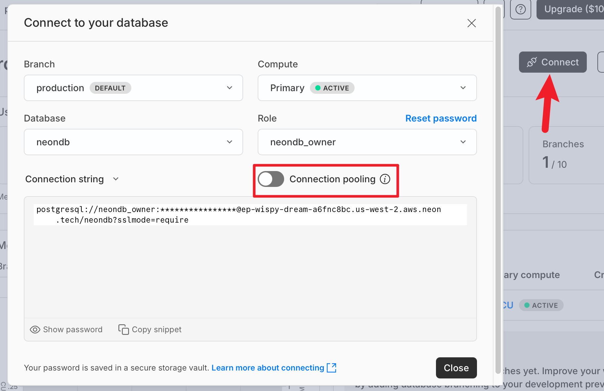
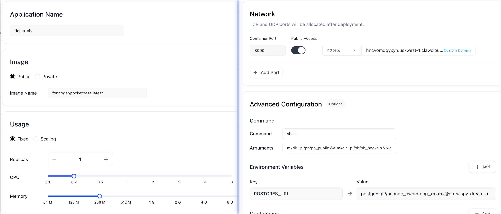
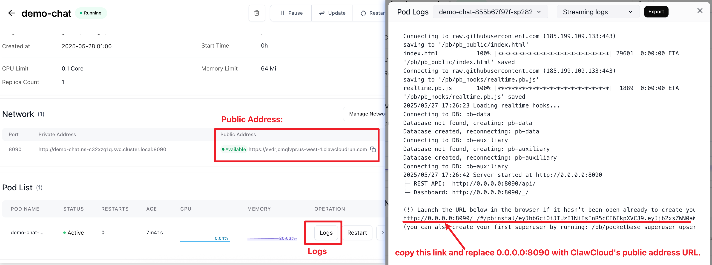
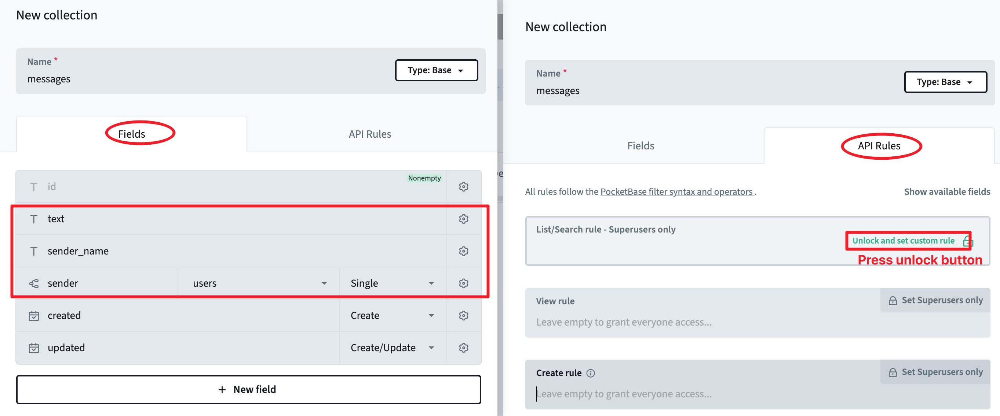

# PocketBase Realtime Chat Demo (with Free Hosting)

To demonstrate the **horizontal scaling** and **realtime** capabilities of [PocketBase - PostgreSQL fork](http://github.com/fondoger/postgres), I have created a realtime chat demo app on two different PocketBase instances. You can open the links below to see the demo:

- Instance 1: [pocketbase-chat-01.mimimiao.com](https://pocketbase-chat-01.mimimiao.com/)
- Instance 2: [pocketbase-chat-02.mimimiao.com](https://pocketbase-chat-02.mimimiao.com/)



### Free Hosting Guide

The above 2 demo sites are free hosted on [ClawCloud Run](https://runclawcloud.sjv.io/Xmovza) (container hosting platform) and [Neon DB](https://neon.tech/) (serverless PostgreSQL DB). You can also set up your own realtime chat demo using the same services. Below are the step-by-step instructions.

Step 1. Create a **free** serverless PostgreSQL database using [Neon DB](https://neon.tech/).

> First, create a new project:
>
> - Project: demo-chat-postgres
> - Postgres Version: 17
> - Database: neondb
> - Cloud Service Provider: Azure
> - Region: Azure East US 2 (Virginia)
>
> Then, update autoscaling settings for _production_ branch:
>
> - Scale From: 0.25 vCPU, 1GB Ram
> - Scale Up To: 0.25 vCPU, 1GB Ram
>
> 
>
> Finally, get connection string of _production_ branch:
>
> 1.  Click on **Connect** button on _production_ branch
> 2.  Uncheck **Connection Pooling** switch button
> 3.  Copy the connection string, which will be used later as environment variable `POSTGRES_URL`.
>
> 

Step 2. Create a **free** PocketBase instance using [ClawCloud Run](https://runclawcloud.sjv.io/Xmovza) (**Important**: Login with your GitHub account to get $5 credit every month).

> First, select **US East** region in the console. (same region as Neon DB for better performance).
>
> Then, open **App Launchpad** and create a new app with the following settings:
>
> - Application Name: demo-chat
> - Image: `ghcr.io/fondoger/pocketbase:latest`
> - Usage: Fixed, 1 Replica, 0.1 vCPU, 64M Memory
> - Network: Port 8090, Enable Public Access
> - Command: `sh -c`, with below arguments:
>   ```
>   mkdir -p /pb/pb_public && mkdir -p /pb/pb_hooks && wget -O /pb/pb_public/index.html https://raw.githubusercontent.com/fondoger/pocketbase/refs/heads/realtime-demo/pb_public/index.html && wget -O /pb/pb_hooks/realtime.pb.js https://raw.githubusercontent.com/fondoger/pocketbase/refs/heads/realtime-demo/pb_hooks/realtime.pb.js && /pb/pocketbase serve --http 0.0.0.0:8090
>   ```
> - Environment Variables:
>   ```
>   POSTGRES_URL=<your-neon-db-connection-string>
>   ```
> - Config Maps: None
> - Local Storage: None
>
> 
>
> Finally, wait a few minutes for the app to be created and started.
> Once the app is running, you can access it via the **Public Address** URL provided by ClawCloud Run.
>
> You will see the realtime chat page, but it will not work yet because the necessary collections and rules are not set up in PocketBase. Go to next step.

Step 3. Sign in to your pocketbase admin dashboard:

> 1.  Open the app `demo-chat` in ClawCloud Run.
> 2.  Click on **Logs** button, you'll see the admin password reset link in the logs. (If not, wait a minute and check again).
> 3.  Copy the link, replace the `http://0.0.0.0:8090` with the **Public Address (HTTPS)** URL of your app, and open it in a new browser tab.
>     
> 4.  Reset the admin password and sign in to the admin dashboard.

Step 4. Sign in to your PocketBase admin dashboard and do below steps:

> Create a new collection:
>
> - Collection Name: `messages`
> - Collection Fields:
>   - `text` (type: Plain Text)
>   - `sender_name` (type: Plain Text)
>   - `sender` (type: Relation to `users` collection)
> - Collection API Rules:
>
>   - List/Search rule: Unlock and set custom rule (Leave empty).
>   - View rule: Unlock and set custom rule (Leave empty).
>   - Create rule: Unlock and set custom rule (Leave empty).
>
> 

Step 5. Conguratulations! You have successfully set up a realtime chat demo using PocketBase and Neon DB.

## Free Hosting on Azure Container Apps

Besides ClawCloud Run, [**Azure Container Apps**](https://azure.microsoft.com/en-us/products/container-apps) also have a free tier that can be used to host PocketBase containers. It is sufficient for small projects. Here are some tips for cost optimization when using Azure Container Apps:

- Use small pod size: **0.25 vCPU and 0.5GB Memory**
- Enable **HTTP Scaling**, set **min replicas=0** to auto shutdown when there is no HTTP traffic.

The good part of Azure Container Apps is that you can easily integrate it with GitHub Actions to automate the deployment process.
