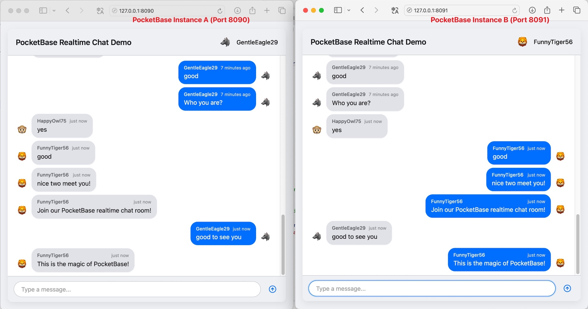

# Realtime Chat demo with Pocketbase JS SDK

Steps:

1. Put `index.html` in `pb_public` folder and start Pocketbase server.
2. Start two different PocketBase instances on different ports (e.g., 8090 and 8091).

    ```
    ./pocketbase serve --http 127.0.0.1:8090
    ```

    ```
    ./pocketbase serve --http 127.0.0.1:8091
    ```
3. Create a new collection called `messages` with the following fields:
   - `text` (type: text)
   - `sender_username` (type: text)
   - `sender` (Relation to `users` collection)


**Sample Screenshot**

